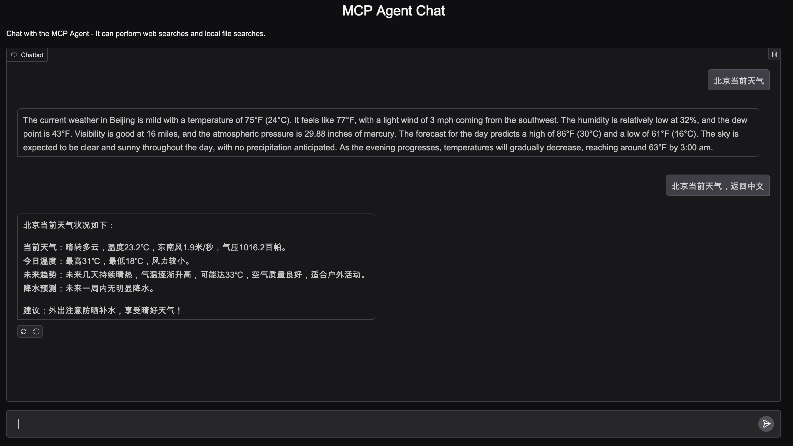

# MCP Agent Setup Guide

This guide explains how to set up and launch the Agent UI.

## Prerequisites

- Bash shell environment
- Required permissions to execute shell scripts

## The first time you run the agent

1. Make the setup script executable:
```bash
chmod +x setup.sh
```

2. Run the setup script:
```bash
./setup.sh
```

The script will:
- Install necessary dependencies
- Configure the environment
- Launch the UI application
- Create a virtual environment and install dependencies in ./mcp_agent_env

## Next time you run the agent

1. Activate the virtual environment:
```bash
source mcp_agent_env/bin/activate
```
2. Run the agent:
```bash
python3.12 agent_gr_ui.py
```

## Agent UI

The UI is a simple HTML page that allows you to interact with the agent.


